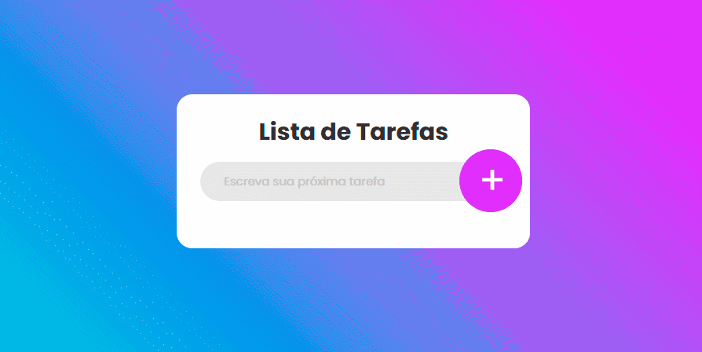

  

  <h1 align="center"> Aplicação para listar tarefas (Todo List) </h1>

  Acesse a aplicação [aqui](https://thirsty-mirzakhani-5b8635.netlify.app/)
  

## 🚀 Tecnologias utilizadas

- ReactJS
- Styled Components
- Java Script

## 📥 Executar esse projeto no seu computador

- Clonar Repositório: `git clone <URL do projeto>`
- Instalar dependências: `yarn install`
- Rodar Aplicação: `yarn start`

## 🛠 Como criar esse projeto do zero
- [Tutorial base](https://www.youtube.com/watch?v=ZcD5rJKm3Lk)

1. [Instalação do Template React](https://github.com/dxwebster/Todo-List/wiki/1.-Instala%C3%A7%C3%A3o-do-Template-React)
2. [Conceitos do React](https://github.com/dxwebster/Todo-List/wiki/2.-Conceitos-do-React)

## 📕 Licença

Todos os arquivos incluídos aqui, incluindo este _README_, estão sob [Licença MIT](./LICENSE). 
Criado com ❤ por [Adriana Lima](https://github.com/dxwebster)
